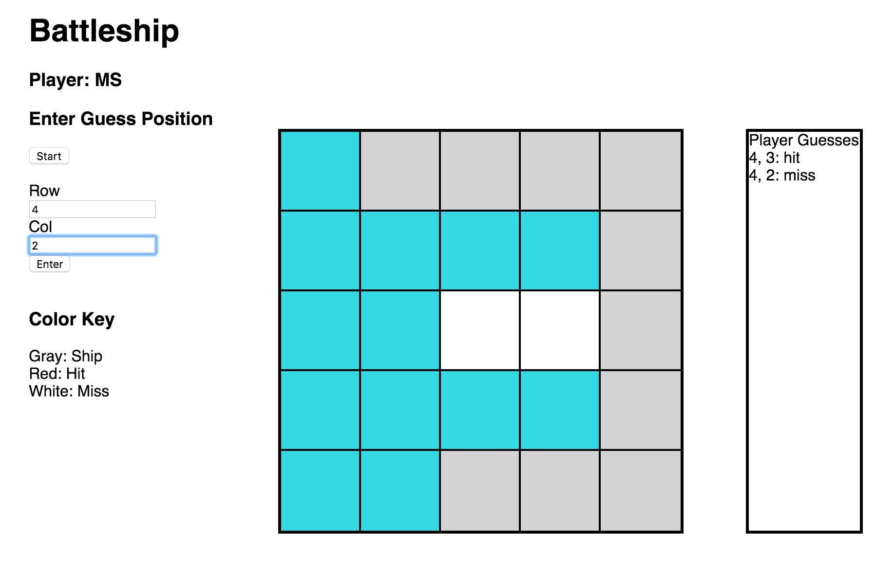

# Battleship-Api

A simplified version of the classic battleship game using React & JSON API.

[Live Demo] (http://battleship-api.herokuapp.com)

## Technical Details

Battleship is built using Rails, Javascript, Node.js, Webpack, & React

## How to Play
  - Enter unique initials to start game
  - Add 10 ships by entering coordinates
  - Computer will randomly place 10 ships
  - Make your guesses count!

## How to Install
  - Clone or download repo
  - Use PostgreSQL database
  - Run `bundle install`
  - Install npm dependencies `npm install`
  - Run `rails server` & `webpack --watch`
  - Use `localhost:3000` port in browser
